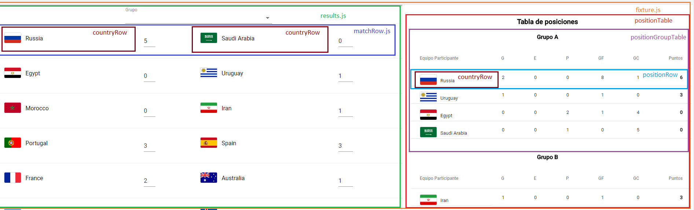
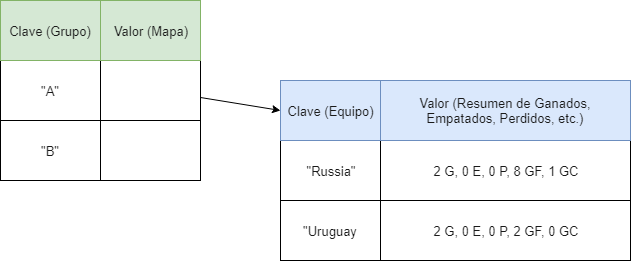
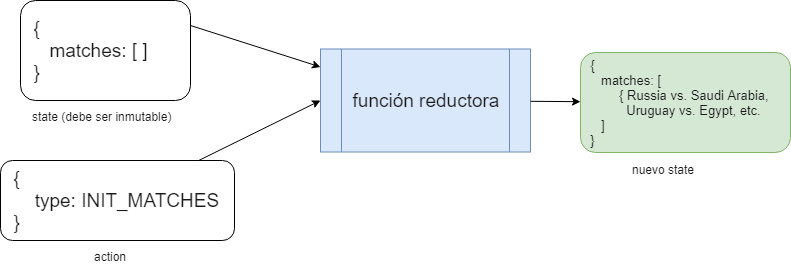
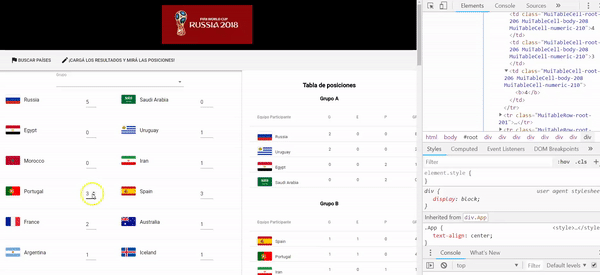
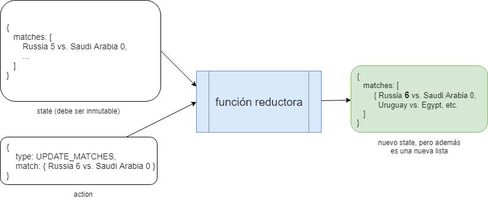

# Mundial 2018 Rusia

[](https://travis-ci.org/uqbar-project/eg-mundial2018-react)


En la tercera iteración, vamos a modificar el caso de uso "Cargar resultados del mundial" para incorporarle una tabla de posiciones dinámica.

# Rutas

No hay nuevas rutas en nuestra aplicación, pero sí hacemos una ligera modificación:

- la ruta raíz '/' muestra la búsqueda de países que participan del mundial
- reemplazamos la ruta '/resultados' por '/fixture'

# Fixture: resultados + tabla de posiciones

## Componentes visuales



## Armado de la tabla de posiciones

Para armar la tabla de posiciones, tomamos como input la lista de partido y hacemos un doble corte de control:

- primero por grupo
- luego por país

Es decir, tenemos un mapa:



Recorremos los partidos generando o actualizando el mapa por grupo y país (archivo _positionTable.js_):

```javascript
const positions = new Map()
this.props.matches.forEach(match => {
    const group = match.group()
    const groupPosition = positions.get(group) || new GroupPosition(group)
    groupPosition.processMatch(match)
    positions.set(group, groupPosition)
})
```

El método processMatch de PositionGroup hace el procesamiento para el equipo local y el visitante:

```javascript
    processMatch(match) {
        this.searchPositionItem(match.teamA).processMatch(match.goalsA, match.goalsB)
        this.searchPositionItem(match.teamB).processMatch(match.goalsB, match.goalsA)
    }

    searchPositionItem(team) {
        let result = this.positionItems.find(item => item.team.matches(team))
        if (!result) {
            result = new PositionItem(team)
            this.positionItems.push(result)
        }
        return result
    }
```

Veamos el método processMatch del objeto de negocio positionItem, que representa una línea dentro de la tabla de posiciones:

```javascript
processMatch(goalsOwn, goalsAgainst) {
    if (goalsOwn === undefined || goalsAgainst === undefined) return
    this.goalsOwn += goalsOwn
    this.goalsAgainst += goalsAgainst
    if (goalsOwn > goalsAgainst) this.won++
    if (goalsOwn < goalsAgainst) this.lost++
    if (goalsOwn === goalsAgainst) this.tied++
}
```

Para mostrar la tabla, el componente PositionTable (vista) en su método render dibuja la tabla de la siguiente manera:

```javascript
return (
    <Card key={'cardPosiciones'}>
        <CardContent key={'contentPosiciones'}>
            <h3>Tabla de posiciones</h3>
            {[...positions].map((itemGroup) => {
                const group = itemGroup[0]
                const positions = itemGroup[1].positions()
                return <PositionGroupTable group={group} positions={positions} key={'positions_group_' + group} />
            }
            )}
        </CardContent>
    </Card>
)
```

Partimos de positions, que es el mapa que construimos previamente. Como el mapa de ECMAScript no conoce la función map, tenemos que pasarlo a una lista utilizando el _spread operator_ `[...positions]`. Esto nos da una lista de objetos que tiene `{grupo: nombre_grupo, groupPosition: lista_de_equipos}`. Pero como la lista de equipos no está ordenada, llamamos a un método en groupPosition que ordena los equipos por puntos:

```javascript
>>GroupPosition
positions() {
    return this.positionItems.sort((item1, item2) => item1.order <= item2.order)
}

>>PositionItem
get order() {
    return this.points * 10000 + this.goalAverage * 100 + this.goalsOwn
}
get points() {
    return this.won * 3 + this.tied
}
```

Bueno, no solo por puntos, también por diferencia de gol y goles a favor.


# React-redux: Estado compartido entre componentes

Tenemos dos componentes que tienen un estado compartido: 

- el componente Results toma como input los partidos del mundial para eventualmente filtrar los de una zona seleccionada (o directamente mostrar todos), y permite editar los resultados del mundial
- el componente PositionTable toma como input los partidos del mundial para armar las tablas de posiciones

Pero además, si alguien modifica un resultado (componente _MatchRow_ hijo del componente padre _Results_), eso debería actualizar la tabla de posiciones. React tiene mecanismos para actualizar estados desde un componente hacia otros, pero esta es una buena ocasión para incorporar **React Redux** a nuestra aplicación, que nos va a permitir manejar un estado compartido entre componentes para simplificar el esquema de notificaciones ante un cambio.


React redux agrega como conceptos:

- el **store** o estado que deberá compartirse entre los componentes, es básicamente un objeto javascript
- **actions**, que se ejecutan ante determinados eventos
- las acciones no modifican directamente el estado, tenemos una indirección o **dispatch**
- que concentra los cambios en una función **reducer** (la palabra reductora puede no decirnos nada, hasta que conozcamos la programación funcional y en particular la función fold), que recibe el estado actual, la información sobre la acción y devuelve un nuevo estado

## Antes de comenzar, un poco de programación funcional

En programación funcional, la función _reduce_ (que en otros lenguajes pueden encontrar como _inject_ o _fold_) permite resolver prácticamente cualquier solución que necesitemos con listas. 

Así, para sumar una lista de números, podemos hacer:

```javascript
> [1, 2, 3, 4].reduce((acum, elem) => acum + elem, 0)
10
```

¿Qué parámetros le pasamos a reduce?

- el segundo parámetro es "la semilla", o valor inicial con el que vamos a trabajar
- el primer parámetro es **la función reductora**, una función que recibe dos parámetros: el primero corresponde al valor "actual" de la reducción, y el segundo se completa con cada uno de los elementos de la lista. El resultado de la función (en este caso la suma) se devuelve valor a la siguiente iteración. Así los subtotales que se van formando son:

```
0   (semilla)
0 (acum) + 1 (elem) => 1
1 (acum) + 2 (elem) => 3 
3 (acum) + 3 (elem) => 6
6 (acum) + 4 (elem) => 10
```

10 es el valor final tras aplicar la reducción.

De la misma manera podemos obtener la productoria de números:

```javascript
[1, 2, 3, 4].reduce((acum, elem) => acum * elem)
24
```

E incluso podemos calcular el máximo de una lista de números:

```javascript
[1, 20, 13, 4].reduce((acum, elem) => Math.max(acum, elem))
20
```

Pero _reduce_ no se aplica solo a listas, también lo podemos aplicar para cualquier objeto. Por ejemplo, si tenemos una persona **inmutable**, podemos definir una función _cumplirAnios_ que en lugar de actualizar a la persona, devuelva **una nueva persona** con la edad incrementada:

```javascript
> const rodri = { nombre: 'Rodrigo Grisolía', edad: 28 }
> const cumplirAnios = (persona, cuantos) => { 
    return { nombre: persona.nombre, edad: persona.edad + cuantos } 
  }

> cumplirAnios(rodri, 1)
// devuelve --> {nombre: "Rodrigo Grisolía", edad: 29}
```

En el ejemplo de React redux vamos a hacer exactamente lo mismo. 

- _cumplirAnios_ es nuestra función reductora
- _rodri_ (la persona), será el state original
- y el evento cumplirAnios se va a disparar a partir de una acción, generando un nuevo state

Veamos cómo se implementa dentro del ejemplo del mundial.

## Store

El store va a guardar los resultados, inicialmente tendrá la lista de partidos vacía. Creamos un archivo _store.js_ dentro del directorio /src/redux:

```javascript
const reducer = (state, action) => {
    ...
    return state
}

export default createStore(reducer, { 
    matches: [] 
})
```

Además, en el archivo /src/index.js debemos envolver el componente principal de la aplicación (App) con un _Provider_ de React Redux al que le pasamos el _store_:

```javascript
import store from './redux/store'
import { Provider } from 'react-redux'

ReactDOM.render(
    <Provider store={store}>
        <div>
            <Favicon url="./favicon.ico" ></Favicon>
            <App />
        </div>
    </Provider>
    , document.getElementById('root'))
registerServiceWorker()
```

## Actions

Tendremos dos acciones que modifican el estado global:

- el componente Fixture cargará la lista de partidos (evento INIT_MATCHES)
- dentro del componente MatchRow el usuario decide actualizar la cantidad de goles que un equipo marcó en un partido (UPDATE_MATCH)

## INIT_MATCHES: Inicialización de los partidos

React-redux propone un esquema donde todo componente se decora con dos funciones: una mapea el store con props del componente (en nuestro caso, _matches_ es la clave que tiene el store), y otra mapea eventos que disparan las acciones que modificarán al store (en este caso, initMatches() que no tiene parámetros). 

```javascript
import { initMatches } from '../redux/actions'

...

const mapStateToProps = state => {
    return {
        matches: state.matches
    }
}

const mapDispatchToProps = dispatch => {
    return {
        initMatches: () => dispatch(initMatches())
    }
}

export default connect(mapStateToProps, mapDispatchToProps)(Fixture)
```

¿De dónde sale initMatches()? Es una función que vamos a definir nosotros en /src/redux/actions:

```javascript
export function initMatches() {
    return {
        type: INIT_MATCHES
    }
}
```

Como el lector verá, la función solamente devuelve un JSON que contiene el _type_ para diferenciar cada una de las acciones, y todos los parámetros que necesita dicha acción para completarse. Esto permite que una acción que requiere 3 parámetros y otra que no requiera parámetros sean polimórficas entre sí: las acciones implementan el **patrón Command** solo que al trabajar en un lenguaje sin chequeo estricto de tipos no necesitan pasar por una interfaz común (aunque si quieren pueden probar eliminar la clave _type_ para comprobar que dejan de ser polimórficas las acciones).

Entonces esta línea:

```javascript
export default connect(mapStateToProps, mapDispatchToProps)(Fixture)
```

Lo que permite es que podamos utilizar como props:

- todas las claves que mapeen contra el estado del _store_, por ejemplo matches
- todas las claves que mapeen contra acciones, por ejemplo initMatches()

Entonces podemos utilizarlo en nuestro componente Fixture, de la siguiente manera:

```javascript
class Fixture extends Component {

    componentWillMount() {
        this.props.initMatches()
    }
    
    render() {
        return (
            <div>
                <MundialAppBar />
                <Grid container spacing={0}>
                    <Grid item xs={7}>
                        <Results matches={this.props.matches} />
                    </Grid>
                    <Grid item xs={5}>
                        <PositionTable matches={this.props.matches} />
                    </Grid>
                </Grid>
            </div>
        )
    }

}
```

Al iniciar el componente, despachamos la acción INIT_MATCHES mediante `this.props.initMatches()`. Y luego le pasamos los partidos a los componentes Results y PositionTable a través del comando `this.props.matches`.

## Función reductora

Hasta aquí el componente despacha la acción de inicialización y simplemente confía en que en el store estará la lista de partidos. ¿Cómo es que se llena esa lista? A partir de completar nuestra primera función reductora (en el archivo _store.js_ en el directorio /src/redux):

```javascript
import { MatchService } from '../services/matchService'

export const INIT_MATCHES = 'INIT_MATCHES'
export const UPDATE_MATCH = 'UPDATE_MATCH'

const reducer = (state, action) => {
    if (action.type === INIT_MATCHES) {
        return {
            matches: new MatchService().getMatches()
        }
    }
    ...
    return state
}
```

Como el lector apreciará, creamos una constante INIT_MATCHES que usamos dentro del archivo _actions.js_ de /src/redux para unificar los nombres de las acciones. Y la parte importante es que aquí invocamos al matchService para pedirle la lista de partidos. La función reductora para este caso particular, recibe un estado inicial donde no hay partidos y la acción de inicializar los partidos, y devuelve un nuevo estado con la lista de partidos inicializada:




## UPDATE_MATCHES: Actualizar el resultado de un partido

El componente MatchRow permite actualizar el resultado de un partido, esto debería actualizar el estado global que contiene todos los partidos para redibujar la tabla de posiciones. Entonces vamos a incorporarlo, mapeando los estados y acciones al componente MatchRow:

```javascript
const mapStateToProps = state => {
    return { }
}

const mapDispatchToProps = dispatch => {
    return {
        updateMatch: (match) => dispatch(updateMatch(match))
    }
}

export default connect(mapStateToProps, mapDispatchToProps)(MatchRow)
```

En verdad, queremos conservar el estado del partido solamente en el componente, y no hacerlo global. Por eso no hay propiedades asociadas al state (queda un objeto JSON vacío). Por el contrario, sí queremos que cuando el usuario modifique el resultado eso dispare la actualización del _store_, despachando la acción updateMatch.

Cuando el usuario modifica la cantidad de goles en el componente se dispara el método changeGoal...

```javascript
>>MatchRow
<TextField
    required
    id={match.teamA.key + '_goles'}
    type="number"
    style={{ width: '2rem' }}
    value={this.props.match.goalsA}
    onChange={(event) => this.changeGoal(match, match.teamA, event.target.value)}
    margin="normal"
/>
```

...y eso refleja un cambio en el estado del componente (que contiene al match), algo que afortunadamente delegamos en él, pero además hace un dispatch del updateMatch (mapeado como parte de los props)

```javascript
>>MatchRow
changeGoal(match, team, goals) {
    match.updateScore(team.name, Math.trunc(goals))
    this.props.updateMatch(match)
    this.setState({
        match: match
    })
}
```

La acción updateMatch se registra en el archivo /src/redux/actions.js:

```javascript
export function updateMatch(match) {
    return {
        type: UPDATE_MATCH,
        match
    }
}
```

Y la recibimos en el _store_ (/src/redux/store.js) actualizando la lista de partidos:

```javascript
const reducer = (state, action) => {
    ...
    if (action.type === UPDATE_MATCH) {
        const indexMatchToReplace = state.matches.findIndex((match) => match.key === action.match.key)
        state.matches[indexMatchToReplace] = action.match 
        return {
            matches: [...state.matches]
        }
    }
    return state
}

export default createStore(reducer, { matches: [] })
```

### Inmutabilidad de la lista de partidos

Si el lector revisó el código anterior, habrá visto que al final no estamos devolviendo la misma lista de partidos, sino que creamos una nueva:

```javascript
        return {
            matches: [...state.matches]
        }
```

Esto es porque dentro de React y en particular también en Redux debemos trabajar con elementos **inmutables**, para que el mecanismo de actualización reactiva funcione. Este mismo código no producirá ningún efecto en la aplicación:

```javascript
const reducer = (state, action) => {
    ...
    if (action.type === UPDATE_MATCH) {
        const indexMatchToReplace = state.matches.findIndex((match) => match.key === action.match.key)
        state.matches[indexMatchToReplace] = action.match 
        return {
            matches: state.matches // no funcionará
        }
    }
    return state
}
```

Pero sí si creamos una **nueva lista**. Entonces, React detectará el cambio y se regenerará la tabla de posiciones:



En este caso la función reductora recibe una lista de partidos, una acción que contiene el nuevo valor para alguno de los partidos, y termina devolviendo como estado nuevo la lista de partidos modificada:



## Resumen general de una solución con React-Redux


Extraído de [este sitio web](https://www.esri.com/arcgis-blog/products/js-api-arcgis/3d-gis/react-redux-building-modern-web-apps-with-the-arcgis-js-api/).

# Testing

No hemos dedicado en esta versión demasiado tiempo al testing, pero para que siga funcionando el test que verifica que Rusia haya hecho 5 goles en la inauguración del mundial, tenemos que hacer algún ajuste. Si no tenemos cuidado, nos aparecerá un mensaje como éste:

```
Invariant Violation: Could not find "store" in either the context or props of "Connect(MatchRow)"
```

Esto es porque Results tiene una lista de MatchRow, que necesitan mapear al _store_ para despacharle acciones. Para lograr que se inyecte correctamente la dependencia, tenemos que 

- mockear el store a partir de la biblioteca redux-mock-store (que importamos solo en modo dev)
- envolverlo en un contexto
- y pasárselo a nuestro mock del componente Results (el que se construye mediante la función _shallow_)

```javascript
it('results show Russia made 5 goals against Saudi Arabia', () => {
  const matches = new MatchService().getMatches()
  const mockStore = configureStore()
  const store = mockStore({matches: matches})
  const context = { store: store }
  const wrapper = shallow(<Results matches={matches}/>, { context })
  const russia_arabia = wrapper.find('#russia_saudi-arabia').dive()
  const goals = russia_arabia.dive().find('#russia_goles')
  expect(goals.props().value).toBe(5)
})
```

Entonces sí funcionará nuestro test, aclarando que no estamos probando que la modificación del resultado impacte en el store.
