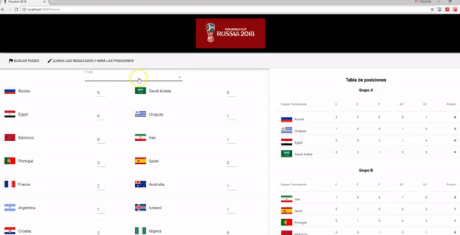
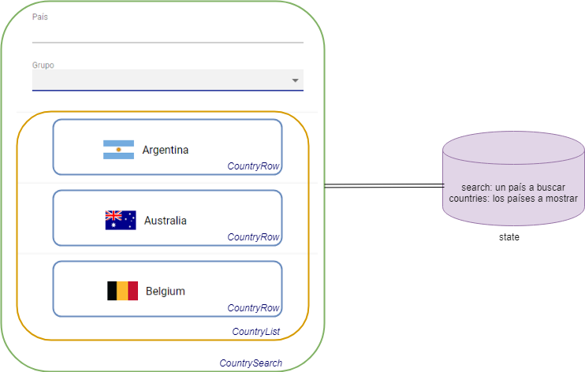

# Mundial 2018 Rusia

[](https://travis-ci.org/uqbar-project/eg-mundial2018-react)



En esta primera iteración podemos buscar los equipos que participan de la copa del mundo Rusia 2018.

# Look & feel

## Material UI

El framework que utilizamos para trabajar el look & feel de la aplicación es [Material UI](https://material-ui.com/), que resulta bastante trabajosa de integrar (pero al menos funciona mejor que [React Toolbox](http://react-toolbox.io/)).

## Fonts y favicon

Para cambiar el font, debemos editar el archivo _index.html_ que está en el directorio /public (que es hermano de src), para incluir la fuente Roboto:

```html
<!DOCTYPE html>
<html lang="en">
  <head>
    ...
    <link rel="stylesheet" href="https://fonts.googleapis.com/css?family=Roboto:300,400,500">
```

Luego en el archivo _/src/index.css_ definimos el fuente por defecto:

```css
body {
  margin: 0;
  padding: 0;
  font-family: 'Roboto', ...
}
```

El lector puede profundizar [en esta página cómo agregar o cambiar fonts en el proyecto](https://scotch.io/@micwanyoike/how-to-add-fonts-to-a-react-project
).


# Arquitectura de los componentes



Tenemos tres componentes definidos, que explicaremos a continuación.

# CountrySearch

Es el componente principal de la aplicación, llamado desde _App.js_:

```javascript
class App extends Component {
  render() {
    return (
      <div className="App">
        <header className="App-header">
          
        </header>
        <CountrySearch></CountrySearch>
      </div>
    )
  }
}
```

Permite ingresar el grupo (en un selector o combo) o bien una descripción para filtrar países y llama al componente CountryList para mostrar la lista de países:

```javascript
    render() {
        return (
            <div>
                <div className="search">
                    <FormControl className="formControl">
                        <FormHelperText>País</FormHelperText>
                        <TextField
                            id="country"
                            value={this.state.search.name}
                            onChange={this.handleChange.bind(this, 'name')}
                        />
                        <br/>
                        <FormHelperText>Grupo</FormHelperText>
                        <Select
                            value={this.state.search.group}
                            onChange={this.handleChange.bind(this, 'group')}
                            inputProps={{
                                name: 'group',
                                id: 'group'
                            }}
                            >
                            <MenuItem value="">
                                <em>Todos</em>
                            </MenuItem>
                            {this.groups.map(group => <MenuItem value={group.split(' ')[1]} key={group}>{group}</MenuItem>)}
                        </Select>
                    </FormControl>
                </div>
                <CountryList countries={this.state.countries} />
            </div>
        )
    }
```

## Llenar el combo de grupos

El countryService le devuelve la lista de grupos en el constructor de CountrySearch:

```javascript
export class CountrySearch extends Component {

    constructor(props) {
        super(props)
        this.countryService = new CountryService()
        this.groups = this.countryService.getGroups()
```

Lo que hace el servicio es transformar la lista de países en una lista de grupos (strings), pasarlo a un set para evitar repetidos y luego mediante el [spread operator](https://developer.mozilla.org/en-US/docs/Web/JavaScript/Reference/Operators/Spread_syntax) lo volvemos a pasar a una lista, porque **no son objetos polimórficos**.

```javascript
getGroups() {
    const groups = countries.map(country => country.fullGroup)
    return [...new Set(groups)].sort()
}
```

La clase Country que representa un país que juega la copa del mundo, tiene una propiedad fullGroup que permite mostrar "Grupo A" en lugar de "A" solamente:

```javascript
get fullGroup() {
    return "Grupo " + this.group.toUpperCase()
}
```

## Manejo del estado

CountrySearch define como estado

- search: un país, que sirve como prototipo para la búsqueda
- countries: los países que queremos mostrar en la página


## Buscar por grupo

Cuando el usuario cambia el valor seleccionado en el combo, tenemos que modificar el estado:

- se genera un nuevo objeto search, con el grupo seleccionado (o un string vacío si no hay opción seleccionada)
- y se actualiza la lista de países en base a lo que nos diga el service

En CountrySearch debemos implementar un método que haga justamente esto:

```javascript
handleChange(property, event) {
    event.preventDefault()
    const search = this.state.search
    search[property] = event.target.value
    this.setState({
        search: search,
        countries: this.countryService.getCountries(search)
    })
}
```

handleChange recibe dos parámetros: la propiedad que queremos modificar y el evento de cambio que produjo el usuario. Esto es útil porque nos va a servir para buscar por descripción también.

Lo primero que debemos saber es que la palabra `this` en javascript [depende del contexto donde estemos ubicados](http://reactkungfu.com/2015/07/why-and-how-to-bind-methods-in-your-react-component-classes/). Esto nos obliga a hacer una pequeña adaptación para definir qué ocurre en el evento onChange del combo:

```javascript
<Select
  value={this.state.search.group}
  onChange={this.handleChange.bind(this, 'group')}
```


bind permite asociar el contexto de `this` a una función: en este caso this es el objeto CountrySearch donde estamos parados, de lo contrario fallará el método cuando necesitemos acceder al estado:

```javascript
handleChange(property, event) {
    event.preventDefault()
    const search = this.state.search
```

porque `this.state` estará apuntando a _undefined_. Cuestiones de la tecnología javascript que si trabajaste con Angular en typescript habrán pasado de largo.

¿Qué devuelve `this.handleChange.bind(this, 'group')`? Una función, que recibe un evento con el cambio que se produjo y genera el nuevo estado. Sí, requiere acostumbrarse al paradigma funcional, lo dejamos para otro momento.

El lector puede investigar [otras opciones](https://medium.freecodecamp.org/the-best-way-to-bind-event-handlers-in-react-282db2cf1530), nosotros mantendremos esta técnica de aquí hasta el final del ejemplo.

## Buscar por descripción

El onChange del input que ingresa el usuario llama también al método handleChange:

```javascript
<TextField
    id="country"
    value={this.state.search.name}
    onChange={this.handleChange.bind(this, 'name')}
```

Solo cambia la propiedad que queremos actualizar. Dado que en javascript un objeto puede ser visto como un mapa de propiedades, es fácil convertir un string en una propiedad que quiero actualizar:

```javascript
> const jugador = { nombre: 'Román Riquelme', camiseta: 10 }
undefined
> jugador.nombre
"Román Riquelme"
> jugador['nombre']
"Román Riquelme"
> jugador['nombre'] = 'César La Paglia'
"César La Paglia"
> jugador.nombre
"César La Paglia"
```

Es decir `jugador.nombre = 'XXX'` y `jugador['nombre'] = 'XXX'` son expresiones equivalentes, por lo tanto podemos construir el objeto search en base a un Country inicial:

```javascript
handleChange(property, event) {
    event.preventDefault()
    const search = this.state.search
    search[property] = event.target.value
```

event.target.value tendrá el grupo seleccionado por el combo o bien el texto de la descripción a buscar.

## Búsqueda by-example de países

La búsqueda by-example de países le pasa el objeto prototípico:

```javascript
getCountries(_country) {
    return countries.filter(country => country.matches(_country))
}
```

La función matches del objeto de dominio Country permite hacer la búsqueda por nombre o grupo, una vez más aprovechando la sintaxis de mapa, donde `this['name']` equivale a hacer `this.name`:

```javascript
matches(_country) {
    return this.match("name", _country) && this.match("group", _country)
}

match(property, other) {
    return this[property].toLowerCase().includes(other[property].toLowerCase())
}
```

## Resumen

1. La vista se renderiza.
2. El usuario escribe 'F' en el texto.
3. Se dispara el evento onChange, donde se modifica la propiedad 'name' del objeto Country a 'F'
4. Llamamos al service que devuelve la lista con un solo país: 'Francia'
5. Generamos un nuevo estado: Country { name: 'F', group: '' } en la clave 'search' y la lista de países con Francia en la clave 'countries'
6. Al cambiar el estado, se renderiza una nueva vista, que muestra la 'F' en el input type='text' porque está ligada al estado.

# CountryList

Este componente recibe una lista de países y delega a CountryRow la visualización:

```javascript
export class CountryList extends Component {
  render() {
      return (
          this.props.countries.map(country =>
              <CountryRow country={country} key={country.name}/>
          )
      )
  }
}
```

Es simplemente un map, pero hacemos una salvedad importante: los países los recibimos dentro de las propiedades (**props**) y no dentro del estado (**state**) ya que la vista no tendrá edición.

# CountryRow

El país muestra el nombre y la bandera. Previamente guardamos las banderas como archivos .png en la carpeta /public/assets (public es hermana de src), respetando el mismo nombre que el país y agregando estas reglas:

- convertimos todas las mayúsculas a minúsculas
- el espacio se reemplaza por '-'

Entonces 'South Korea' queda 'south-korea.png', 'Uruguay' queda como 'uruguay.png'. Esto lo definimos en la propiedad _flag_ del objeto Country:

```javascript
get flag() {
    return this.name.replace(' ', '-').toLowerCase() + '.png'
}
```

Y el CountryRow queda definido de esta manera:

```javascript
export class CountryRow extends Component {
  render() {
      return (
          <div>
              <Card>
                  <CardContent>
                      <p>
                      
                      &nbsp;
                      &nbsp;
                      {this.props.country.name}
                      </p>
                  </CardContent>
              </Card>
          </div>
      )
  }
}
```

Aquí estamos usando el Card de Material UI.

# Testing

TODO