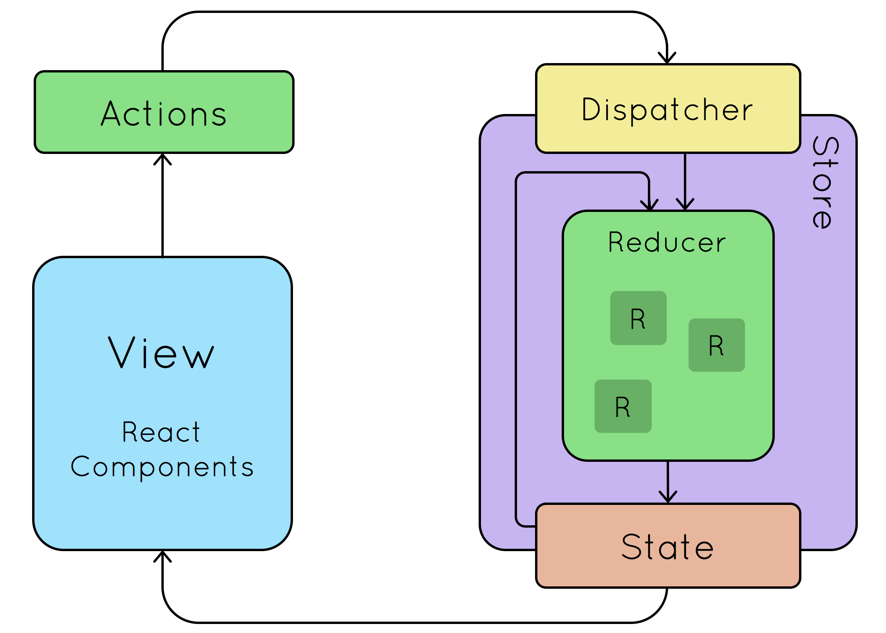

# Mundial 2018 Rusia

[](https://travis-ci.org/uqbar-project/eg-mundial2018-react)


En la tercera iteración, vamos a modificar el caso de uso "Cargar resultados del mundial" para incorporarle una tabla de posiciones dinámica.

# Rutas

No hay nuevas rutas en nuestra aplicación, pero sí hacemos una ligera modificación:

- la ruta raíz '/' muestra la búsqueda de países que participan del mundial
- reemplazamos la ruta '/resultados' por '/fixture'

# Fixture: resultados + tabla de posiciones

## Componentes visuales


## Armado de la tabla de posiciones


# React-redux: Estado compartido entre componentes

Tenemos dos componentes que tienen un estado compartido: 

- el componente Results toma como input los partidos del mundial para eventualmente filtrar los de una zona seleccionada (o directamente mostrar todos), y permite editar los resultados del mundial
- el componente PositionTable toma como input los partidos del mundial para armar las tablas de posiciones

Pero además, si alguien modifica un resultado (componente _MatchRow_ hijo del componente padre _Results_), eso debería actualizar la tabla de posiciones. React tiene mecanismos para actualizar estados desde un componente hacia otros, pero esta es una buena ocasión para incorporar **React Redux** a nuestra aplicación, que nos va a permitir manejar un estado compartido entre componentes para simplificar el esquema de notificaciones ante un cambio.


React redux agrega como conceptos:

- el **store** o estado que deberá compartirse entre los componentes, es básicamente un objeto javascript
- **actions**, que se ejecutan ante determinados eventos
- las acciones no modifican directamente el estado, tenemos una indirección o **dispatch**
- que concentra los cambios en una función **reducer** (la palabra reductora puede no decirnos nada, hasta que conozcamos la programación funcional y en particular la función fold), que recibe el estado actual, la información sobre la acción y devuelve un nuevo estado

## Antes de comenzar, un poco de programación funcional

En programación funcional, la función _reduce_ (que en otros lenguajes pueden encontrar como _inject_ o _fold_) permite resolver prácticamente cualquier solución que necesitemos con listas. 

Así, para sumar una lista de números, podemos hacer:

```javascript
> [1, 2, 3, 4].reduce((acum, elem) => acum + elem, 0)
10
```

¿Qué parámetros le pasamos a reduce?

- el segundo parámetro es "la semilla", o valor inicial con el que vamos a trabajar
- el primer parámetro es **la función reductora**, una función que recibe dos parámetros: el primero corresponde al valor "actual" de la reducción, y el segundo se completa con cada uno de los elementos de la lista. El resultado de la función (en este caso la suma) se devuelve valor a la siguiente iteración. Así los subtotales que se van formando son:

```
0   (semilla)
0 (acum) + 1 (elem) => 1
1 (acum) + 2 (elem) => 3 
3 (acum) + 3 (elem) => 6
6 (acum) + 4 (elem) => 10
```

10 es el valor final tras aplicar la reducción.

De la misma manera podemos obtener la productoria de números:

```javascript
[1, 2, 3, 4].reduce((acum, elem) => acum * elem)
24
```

E incluso podemos calcular el máximo de una lista de números:

```javascript
[1, 20, 13, 4].reduce((acum, elem) => Math.max(acum, elem))
20
```

Pero _reduce_ no se aplica solo a listas, también lo podemos aplicar para cualquier objeto. Por ejemplo, si tenemos una persona **inmutable**, podemos definir una función _cumplirAnios_ que en lugar de actualizar a la persona, devuelva **una nueva persona** con la edad incrementada:

```javascript
> const rodri = { nombre: 'Rodrigo Grisolía', edad: 28 }
> const cumplirAnios = (persona, cuantos) => { 
    return { nombre: persona.nombre, edad: persona.edad + cuantos } 
  }

> cumplirAnios(rodri, 1)
// devuelve --> {nombre: "Rodrigo Grisolía", edad: 29}
```

En el ejemplo de React redux vamos a hacer exactamente lo mismo. 

- _cumplirAnios_ es nuestra función reductora
- _rodri_ (la persona), será nuestro store
- y el evento cumplirAnios se va a disparar a partir de una acción 

Veamos cómo se implementa dentro del ejemplo del mundial.

## Store

El store va a guardar los resultados, inicialmente tendrá la lista de partidos vacía. Creamos un archivo _store.js_ dentro del directorio /src/redux:

```javascript
const reducer = (state, action) => {
    ...
    return state
}

export default createStore(reducer, { 
    matches: [] 
})
```

Además, en el archivo /src/index.js debemos envolver el componente principal de la aplicación (App) con un _Provider_ de React Redux al que le pasamos el _store_:

```javascript
import store from './redux/store'
import { Provider } from 'react-redux'

ReactDOM.render(
    <Provider store={store}>
        <div>
            <Favicon url="./favicon.ico" ></Favicon>
            <App />
        </div>
    </Provider>
    , document.getElementById('root'))
registerServiceWorker()
```

## Actions

Tendremos dos acciones que modifican el estado global:

- el componente Fixture cargará la lista de partidos (evento INIT_MATCHES)
- dentro del componente MatchRow el usuario decide actualizar la cantidad de goles que un equipo marcó en un partido (UPDATE_MATCH)

## INIT_MATCHES: Inicialización de los partidos

React-redux propone un esquema donde todo componente se decora con dos funciones: una mapea el store con props del componente (en nuestro caso, _matches_ es la clave que tiene el store), y otra mapea eventos que disparan las acciones que modificarán al store (en este caso, initMatches() que no tiene parámetros). 

```javascript
import { initMatches } from '../redux/actions'

...

const mapStateToProps = state => {
    return {
        matches: state.matches
    }
}

const mapDispatchToProps = dispatch => {
    return {
        initMatches: () => dispatch(initMatches())
    }
}

export default connect(mapStateToProps, mapDispatchToProps)(Fixture)
```

¿De dónde sale initMatches()? Es una función que vamos a definir nosotros en /src/redux/actions:

```javascript
export function initMatches() {
    return {
        type: INIT_MATCHES
    }
}
```

Como el lector verá, la función solamente devuelve un JSON que contiene el _type_ para diferenciar cada una de las acciones, y todos los parámetros que necesita dicha acción para completarse. Esto permite que una acción que requiere 3 parámetros y otra que no requiera parámetros sean polimórficas entre sí: las acciones implementan el **patrón Command** solo que al trabajar en un lenguaje sin chequeo estricto de tipos no necesitan pasar por una interfaz común (aunque si quieren pueden probar eliminar la clave _type_ para comprobar que dejan de ser polimórficas las acciones).

Entonces esta línea:

```javascript
export default connect(mapStateToProps, mapDispatchToProps)(Fixture)
```

Lo que permite es que podamos utilizar como props:

- todas las claves que mapeen contra el estado del _store_, por ejemplo matches
- todas las claves que mapeen contra acciones, por ejemplo initMatches()

Entonces podemos utilizarlo en nuestro componente Fixture, de la siguiente manera:

```javascript
class Fixture extends Component {

    componentWillMount() {
        this.props.initMatches()
    }
    
    render() {
        return (
            <div>
                <MundialAppBar />
                <Grid container spacing={0}>
                    <Grid item xs={7}>
                        <Results matches={this.props.matches} />
                    </Grid>
                    <Grid item xs={5}>
                        <PositionTable matches={this.props.matches} />
                    </Grid>
                </Grid>
            </div>
        )
    }

}
```

Al iniciar el componente, despachamos la acción INIT_MATCHES mediante this.props.initMatches(). Y luego le pasamos los partidos a los componentes Results y PositionTable a través del comando `this.props.matches`.

## Función reductora

Hasta aquí el componente despacha la acción de inicialización y simplemente confía en que en el store estará la lista de partidos. ¿Cómo es que se llena esa lista? A partir de completar nuestra primera función reductora (en el archivo _store.js_ en el directorio /src/redux):

```javascript
import { MatchService } from '../services/matchService'

export const INIT_MATCHES = 'INIT_MATCHES'
export const UPDATE_MATCH = 'UPDATE_MATCH'

const reducer = (state, action) => {
    if (action.type === INIT_MATCHES) {
        return {
            matches: new MatchService().getMatches()
        }
    }
    ...
    return state
}
```

Como el lector apreciará, creamos una constante INIT_MATCHES que usamos dentro del archivo _actions.js_ de /src/redux para unificar los nombres de las acciones. Y la parte importante es que aquí invocamos al matchService para pedirle la lista de partidos. La función reductora para este caso particular, recibe un estado inicial donde no hay partidos y la acción de inicializar los partidos, y devuelve un nuevo estado con la lista de partidos inicializada:


## Resumen general de una solución con React-Redux



Extraído de [este sitio web](https://www.esri.com/arcgis-blog/products/js-api-arcgis/3d-gis/react-redux-building-modern-web-apps-with-the-arcgis-js-api/).

# Testing

Basándonos en [este artículo](https://hackernoon.com/unit-testing-redux-connected-components-692fa3c4441c), 
