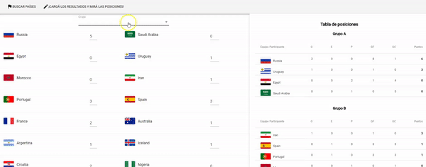

# Mundial 2018 Rusia

En la tercera iteración, vamos a modificar el caso de uso "Cargar resultados del mundial" para incorporarle una tabla de posiciones dinámica.

# Rutas

No hay nuevas rutas en nuestra aplicación, pero sí hacemos una ligera modificación:

- la ruta raíz '/' muestra la búsqueda de países que participan del mundial
- reemplazamos la ruta '/resultados' por una 

# Carga de resultados

## Componentes visuales

## Armado de la tabla de posiciones

# Estado compartido entre componentes

## Actions

## Store

## Redux

# Testing
